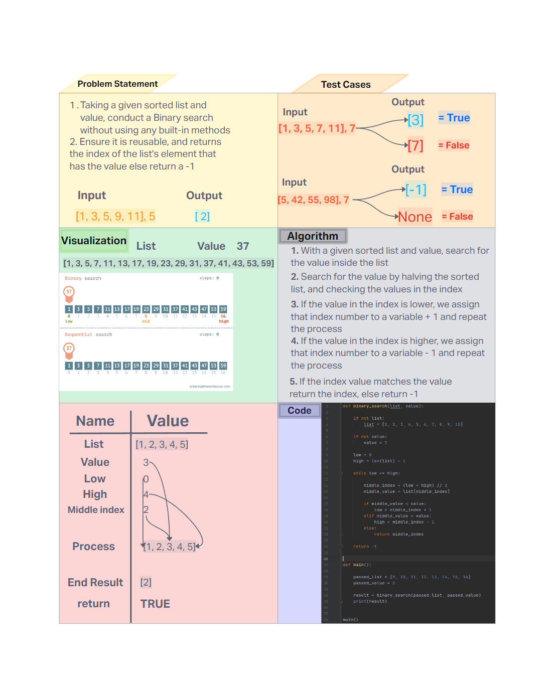

# Challenge Title
<!-- Description of the challenge -->
- Make binary search function without using any built-in methods that will accomplish the challenge solely on it's on.

## Whiteboard Process
<!-- Embedded whiteboard image -->


## Approach & Efficiency
<!-- What approach did you take? Why? What is the Big O space/time for this approach? -->

- The binary search approach is used a lot in sorted lists as this is considered more efficient by repeatedly dividing the list in half to find the value. The time complexity of this is O(log n), the.  The space complexity is O(1) since it doesn't requre extra space proportional to the list size as it works directly on the list.

## Solution
<!-- Show how to run your code, and examples of it in action -->

- Define `binary_search` in Python environment and call the function with a sorted list and wanted value.

1. **Happy Case** (Value Found): binary_search([1, 2, 3, 4, 5], 3) returns 2 (index  of value 3).
2. **Edge Case** (Empty List): binary_search([], 3) returns -1, indicating the value is not found as the list is empty.
3. **Expected Failure** (Value Not Found): binary_search([1, 2, 4, 5], 3) returns -1, since 3 is not in the list.

```
def binary_search(list, value):

    if list == []:
        return -1

    if not list:
        list = [1, 2, 3, 4, 5]

    if not value:
        value = 3

    low = 0
    high = len(list) - 1

    while low <= high:

        middle_index = (low + high) // 2
        middle_value = list[middle_index]

        if middle_value < value:
            low = middle_index + 1
        elif middle_value > value:
            high = middle_index - 1
        else:
            return middle_index

    return -1


def main():

    passed_list = [9, 10, 11, 12, 13, 14, 15, 16]
    passed_value = 5

    result = binary_search(passed_list, passed_value)
    print(result)


main()

```