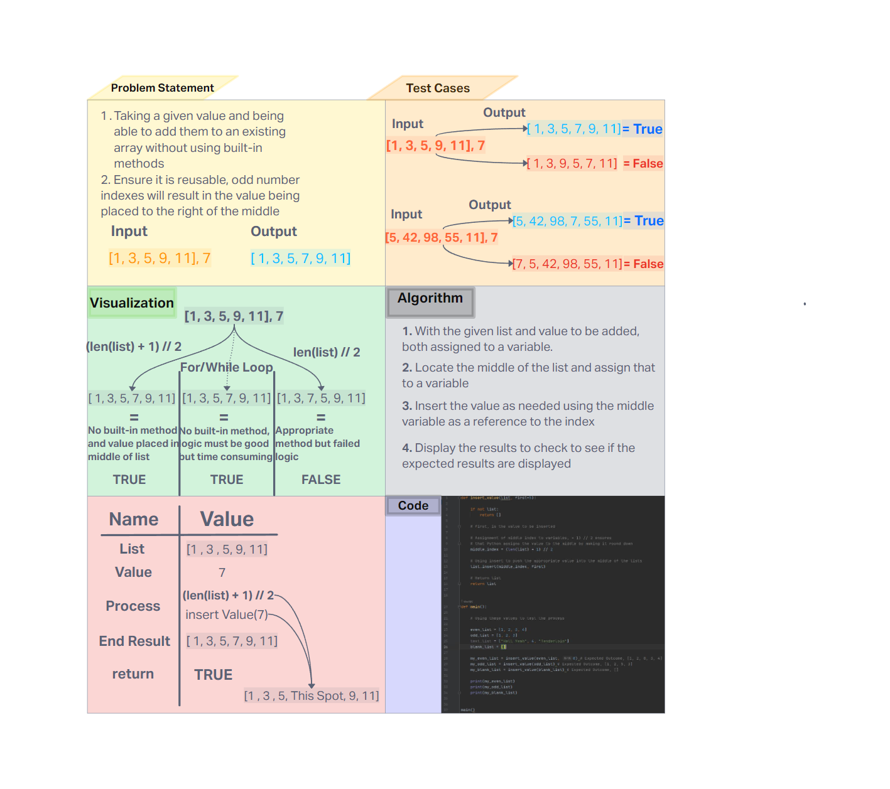

# Challenge Title
<!-- Description of the challenge -->
- To be able to insert a value in the middle of list without using built-in methods.

## Whiteboard Process
<!-- Embedded whiteboard image -->


## Approach & Efficiency
<!-- What approach did you take? Why? What is the Big O space/time for this approach? -->

- Given the list passed the function will locate the middle of the list and input a given value or a default value for testing. The time complexity is O(n) as the time is influenced by the list size. Space complexity is O(1) as the function uses a fixed amount of space and does not make any additional lists as it modifies an existing list.

## Solution
<!-- Show how to run your code, and examples of it in action -->

- Happy Path - Passing a list with or without a value to be inserted
- Expected Failure - Passing an empty list will check to see if it's empty then return empty
- Edge Cases(Tuple or non list) - Passing anything that isn't a list will result in an empty array being passed back

```def insert_value(list, first=5):

    if not list:
        return []

    # first, is the value to be inserted

    # Assignment of middle index to variables, + 1) // 2 ensures
    # that Python assigns the value to the middle by making it round down
    middle_index = (len(list) + 1) // 2

    # Using insert to push the appropriate value into the middle of the lists
    list.insert(middle_index, first)

    # Return list
    return list


def main():

    # Using these values to test the process

    even_list = [1, 2, 3, 4]
    odd_list = [1, 2, 3]
    text_list = ["Hell Yeah", 4, "Tenderloin"]
    blank_list = []

    my_even_list = insert_value(even_list, 8) # Expected Outcome, [1, 2, 8, 3, 4]
    my_odd_list = insert_value(odd_list) # Expected Outcome, [1, 2, 5, 3]
    my_blank_list = insert_value(blank_list) # Expected Outcome, []

    print(my_even_list)
    print(my_odd_list)
    print(my_blank_list)


main()
```