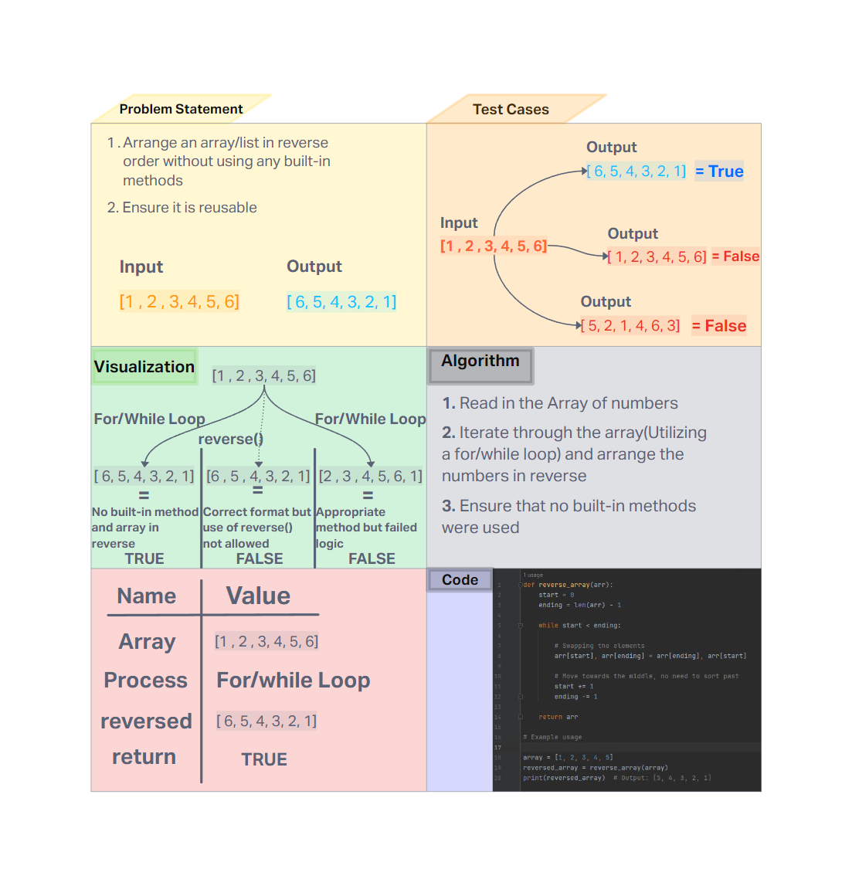

# Challenge Title
<!-- Description of the challenge -->
- To be able to reverse an array without using the built-in methods(e.g `reverse()`)

## Whiteboard Process
<!-- Embedded whiteboard image -->


## Approach & Efficiency
<!-- What approach did you take? Why? What is the Big O space/time for this approach? -->

- My approach was to use a while loop to reverse the given array, by declaring variables to act as the start and end of the array index and making a condition to ensure that the start index will never go past the end index. The start will increment while the end will deincrement until they reach the middle in which all the data will have been swapped. The time complexity is O(1) as it goes through each element one time while the time complexity is O(1) since the memory usage is constant regardless of size.

## Solution
<!-- Show how to run your code, and examples of it in action -->
- Happy Path
```
def reverse_array(arr):
    start = 0
    ending = len(arr) - 1

    while start < ending:

        # Swapping the elements
        arr[start], arr[ending] = arr[ending], arr[start]

        # Move towards the middle, no need to sort past
        start += 1
        ending -= 1

    return arr

# Example usage

array = [1, 2, 3, 4, 5]
reversed_array = reverse_array(array)
print(reversed_array)  # Output: [5, 4, 3, 2, 1]

```

- Expected Failure - Not a list
- Edge Case - Empty list

```
def reverse_array(arr):
    # Check if the input is a list
    if not isinstance(arr, list):
        return "Error: Input must be a list"

    # Handle empty list
    if len(arr) == 0:
        return arr

    start = 0
    ending = len(arr) - 1

    while start < ending:
        arr[start], arr[ending] = arr[ending], arr[start]
        start += 1
        ending -= 1

    return arr

# Edge Case

empty_array = []
reversed_empty_array = reverse_array(empty_array)
print(reversed_empty_array)  # Output: []

# Expected Failure

non_list = 123
reversed_non_list = reverse_array(non_list)
print(reversed_non_list)  # Output: Error message
```