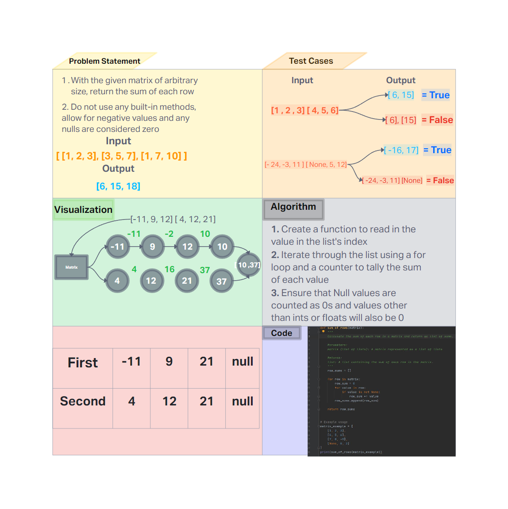

# Challenge Title
<!-- Description of the challenge -->
- To make a function without using built-in functions to get the sum of the values inside the lists

## Whiteboard Process
<!-- Embedded whiteboard image -->


## Approach & Efficiency
<!-- What approach did you take? Why? What is the Big O space/time for this approach? -->

- The approach taken involves iterating through each row of the matrix and calculating the sum of its elements. This method ensures that all elements, regardless of the matrix's shape or row length, are processed correctly.  
Time complexity is O(n*m), n is the rows and m is the average number.  Space complexity is O(n), scales based off of the number of rows.
## Solution
<!-- Show how to run your code, and examples of it in action -->

```
happy_matrix = [
    [1, -2, 3],
    [4, 5, None],
    [None, -8, 9]
]
edge_matrix = [
    [],
    [None, None, None],
    [3, 4, 5]
]
e_failure_matrix = [
    [1, 2, "a"],
    [3, "b", 5]
]

print(sum_of_rows(happy_matrix))  # Expected output: [2, 9, 1]
print(sum_of_rows(edge_matrix))  # Expected output: [0, 0, 12]

try:
    print(sum_of_rows(e_failure_matrix))  # Should raise an error
except TypeError as e:
    print("TypeError:", e)
```