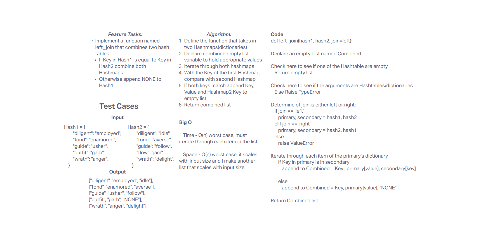

# Challenge Title
- To make a function without using built-in functions to get the sum of the values inside the lists

## Whiteboard Process


## Approach & Efficiency

- Time Complexity

    - **O(n)** - worst case, will iterate through each item in a list

- Space Complexity

    - **O(n)** - extra space needed to keep track of the common keys and combined hashtables

## Solution

```
happy_matrix = [
    [1, -2, 3],
    [4, 5, None],
    [None, -8, 9]
]
edge_matrix = [
    [],
    [None, None, None],
    [3, 4, 5]
]
e_failure_matrix = [
    [1, 2, "a"],
    [3, "b", 5]
]

print(sum_of_rows(happy_matrix))  # Expected output: [2, 9, 1]
print(sum_of_rows(edge_matrix))  # Expected output: [0, 0, 12]

try:
    print(sum_of_rows(e_failure_matrix))  # Should raise an error
except TypeError as e:
    print("TypeError:", e)
```


def left_join(hash1, hash2, join='left'):
    """Left join two hash tables."""
    
    combined = []
    
    if not hash1 or not hash2:
        return []
    
    if not isinstance(hash1, dict) or not isinstance(hash2, dict):
        raise TypeError
    
    if join == 'left':
        primary, secondary = hash1, hash2
    elif join == 'right':
        primary, secondary = hash2, hash1
    else:
        raise ValueError
        
    for key, value in primary.items():
        if key in secondary:
            combined.append([key, value, secondary[key]])
        else:
            combined.append([key, value, "NONE"])
    
    return combined