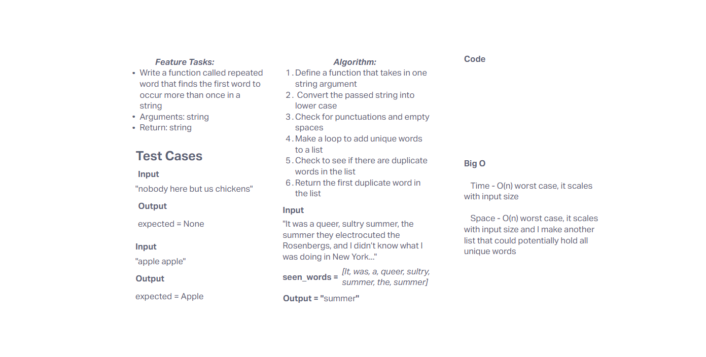

# Challenge Title
hashtable repeated word

## Whiteboard Process


## Approach & Efficiency
With the given string, normalize the string, split the string into words and return the first duplicate unique word

- Time Complexity

    - **repeated_word: O(n)** - worst case, scales with input size, goes through each word

- Space Complexity

    - **repeated_word: O(n)** - worst case, scales with input size, creates a new list to hold unique words

## Solution
```
import re

def first_repeated_word(string):
    lower_cased = string.lower()
    words = re.findall(r'\b\w+\b', lower_cased)
    
    words_seen = set()
    for word in words:
        if word in words_seen:
            return word
        words_seen.add(word)
    return None
```

### Happy Case Test
```
def happy_case():
    actual = first_repeated_word("It was a bright cold day in April, and the clocks were striking thirteen.")
    expected = "a"
    assert actual == expected
```
### Edge Case Test
```
def edge_case():
    actual = first_repeated_word("Unique words only once.")
    expected = None
    assert actual == expected
```
### Expected Failure Test

```
def expected_failure_case():
    actual = first_repeated_word("")
    expected = None
    assert actual == expected
```
