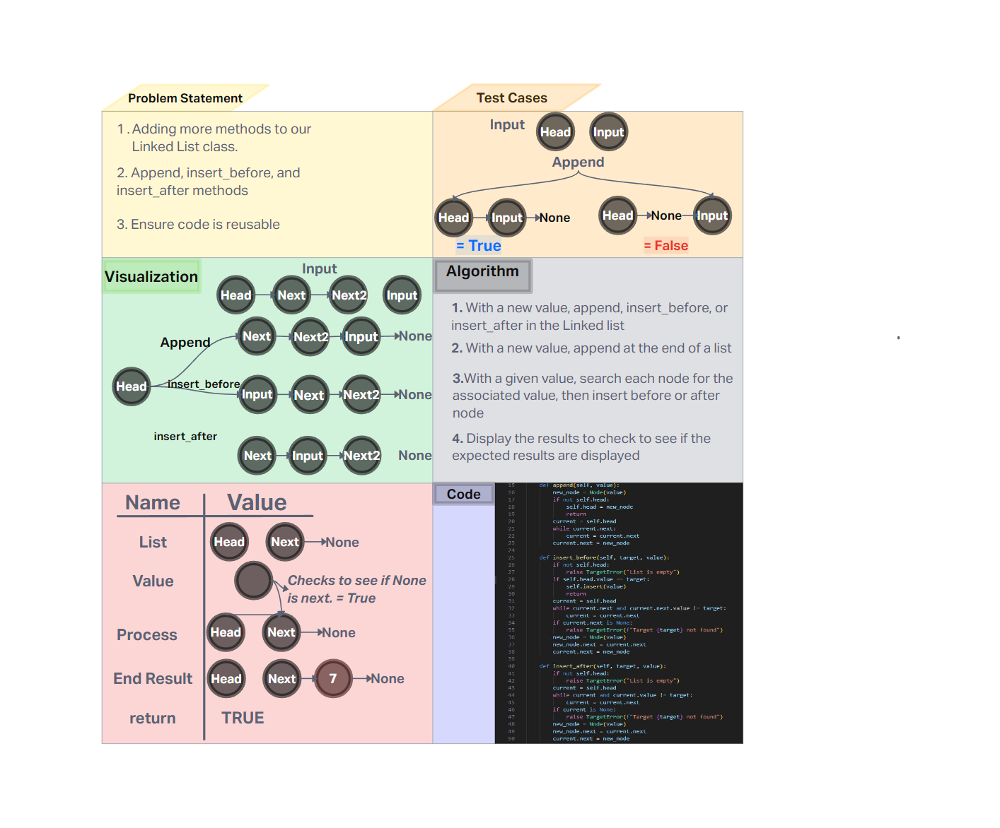

# Challenge Title
Linked Lists Insertions

## Whiteboard Process


## Approach & Efficiency
Creation of a node class that represents the node in a linked list.

- Time Complexity

    - **append: O(n)** - worst-case, you'll have to go through each node once
    - **insert_before: O(n)** - worst case is it'll need to go through the whole list
    - **insert_after: O(n)** - worst case is it'll need to go through the whole list

- Space Complexity

    - **append: O(1)** - Creation of one new node
    - **insert_before: O(1)** - Creation of one new node
    - **insert_after: O(n)** - Creation of one new node

## Solution

- Happy Case: 

```
# Append
linked_list = LinkedList()
linked_list.insert(1)
linked_list.insert(2)
linked_list.append(3)
assert str(linked_list) == "{ 2 } -> { 1 } -> { 3 } -> NULL"

# Insert Before
linked_list = LinkedList()
linked_list.insert(3)
linked_list.insert(2)
linked_list.insert(1)
linked_list.insert_before(2, 4)
assert str(linked_list) == "{ 1 } -> { 4 } -> { 2 } -> { 3 } -> NULL"

# Insert After
linked_list = LinkedList()
linked_list.insert(3)
linked_list.insert(2)
linked_list.insert(1)
linked_list.insert_after(2, 4)
assert str(linked_list) == "{ 1 } -> { 2 } -> { 4 } -> { 3 } -> NULL"
```

- Edge Case: Checks to the head of the empty list, points to newly inserted node

```
# Append on an empty list
linked_list = LinkedList()
linked_list.append(1)
assert str(linked_list) == "{ 1 } -> NULL"

# Insert Before the head
linked_list = LinkedList()
linked_list.insert(2)
linked_list.insert(1)
linked_list.insert_before(1, 0)
assert str(linked_list) == "{ 0 } -> { 1 } -> { 2 } -> NULL"

# Insert After the last element
linked_list = LinkedList()
linked_list.insert(2)
linked_list.insert(1)
linked_list.insert_after(2, 3)
assert str(linked_list) == "{ 1 } -> { 2 } -> { 3 } -> NULL"
```

- Expected Failure

```
# Append on an empty list
linked_list = LinkedList()
linked_list.append(1)
assert str(linked_list) == "{ 1 } -> NULL"

# Insert Before the head
linked_list = LinkedList()
linked_list.insert(2)
linked_list.insert(1)
linked_list.insert_before(1, 0)
assert str(linked_list) == "{ 0 } -> { 1 } -> { 2 } -> NULL"

# Insert After the last element
linked_list = LinkedList()
linked_list.insert(2)
linked_list.insert(1)
linked_list.insert_after(2, 3)
assert str(linked_list) == "{ 1 } -> { 2 } -> { 3 } -> NULL"
```