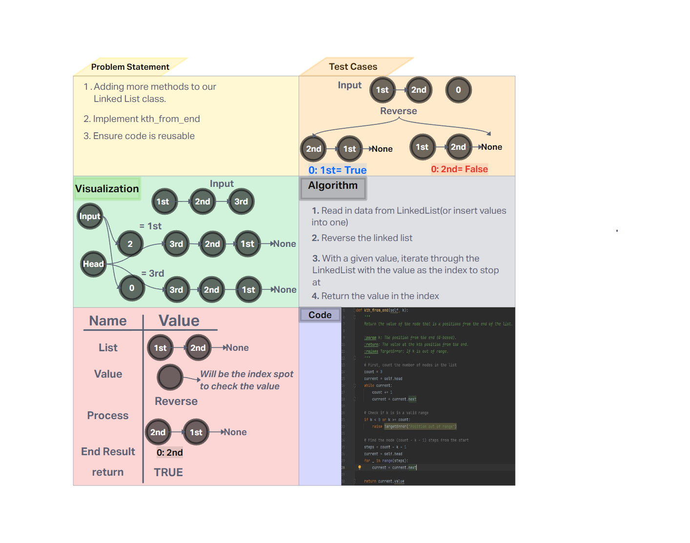

# Challenge Title
Implemented kth_from_end

## Whiteboard Process


## Approach & Efficiency
Creation of a node class that represents the node in a linked list.

- Time Complexity

    - **kth_from_end: O(n)** - worst case, might tranverse the whole list

- Space Complexity

    - **kth_from_end: O(1)** - No additional space needed that scales with size

## Solution


### Happy Case Test
```

def test_kth_from_end_happy():
    linked_list = LinkedList()
    values = ["A", "B", "C", "D", "E"]
    for value in reversed(values):
        linked_list.insert(value)
    actual = linked_list.kth_from_end(2)
    expected = "D"
    assert actual == expected, f"Expected {expected}, got {actual}"
```
### Edge Case Test
```

def test_kth_from_end_edge():
    linked_list = LinkedList()
    values = ["A", "B", "C", "D", "E"]
    for value in reversed(values):
        linked_list.insert(value)
    actual = linked_list.kth_from_end(0)
    expected = "E"
    assert actual == expected, f"Expected {expected}, got {actual}"
```
### Expected Failure Test
```

def test_kth_from_end_failure():
    linked_list = LinkedList()
    values = ["A", "B", "C", "D", "E"]
    for value in reversed(values):
        linked_list.insert(value)
    with pytest.raises(TargetError):
        linked_list.kth_from_end(5)
```


# Run the tests
if __name__ == "__main__":
    pytest.main()
