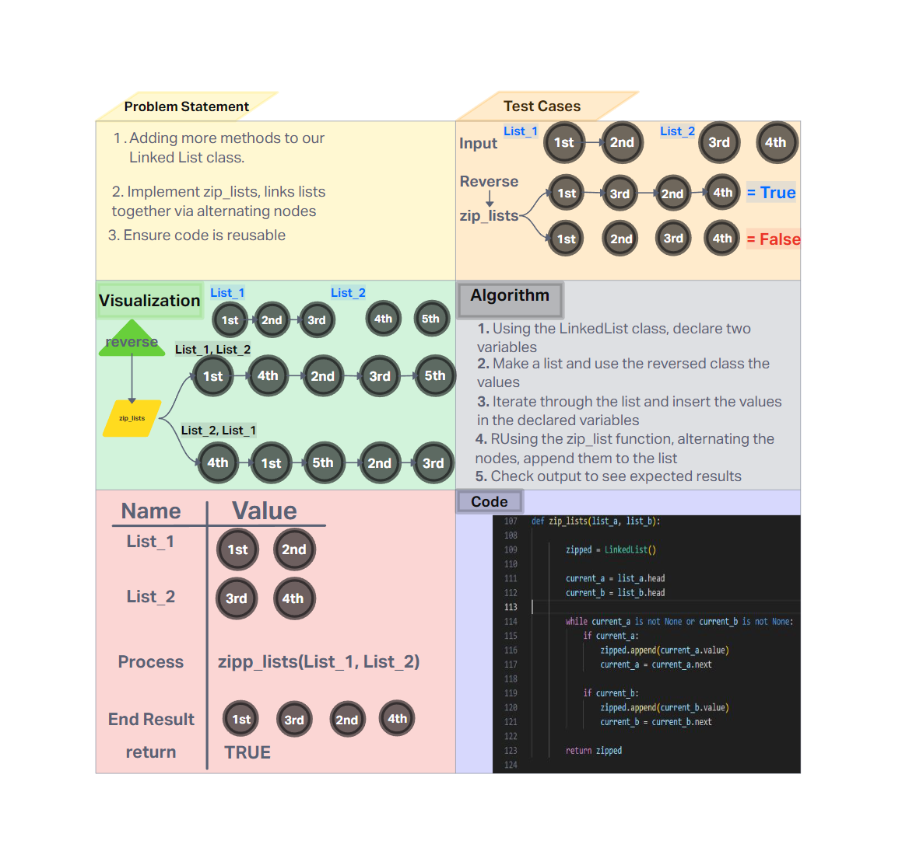

# Challenge Title
Implemented zip_lists

## Whiteboard Process


## Approach & Efficiency
Creation of a function to combine two linkedlists via alternatiing

- Time Complexity

    - **zip_lists: O(n)** - worst case, has to tranverse the whole list

- Space Complexity

    - **zip_list: O(n)** - Creates a new list with the combined lists

## Solution


### Happy Case Test
```

def test_even_length():
    list_a = LinkedList()
    for value in reversed([1, 2, 3]):
        list_a.insert(value)

    list_b = LinkedList()
    for value in reversed(["a", "b", "c"]):
        list_b.insert(value)

    actual = zip_lists(list_a, list_b)
    expected = LinkedList()
    for value in reversed([1, "a", 2, "b", 3, "c"]):
        expected.insert(value)

    assert str(actual) == str(expected)

```
### Edge Case Test
```

def test_not_the_same():
    list_a = LinkedList()
    for value in reversed(["いち", "に", "さん"]):
        list_a.insert(value)
    list_b = LinkedList()
    for value in reversed(["일 il", "이 i", "삼 sam"]):
        list_b.insert(value)
    actual = zip_lists(list_a, list_b)
    expected = LinkedList()
    for value in reversed(["いち","일 il", "に","이 i", "さん", "삼 sam"]):
        expected.insert(value)
        
    assert actual != expected
```
### Expected Failure Test

```
list_a = LinkedList()
list_b = LinkedList()

list_a.append(1)
list_a.append(2)
list_a.head.next = list_a.head  # Creating a circular linked list

list_b.append(3)
list_b.append(4)

result = zip_lists(list_a, list_b)
# This scenario could lead to an infinite loop as list_a is circular.
```
