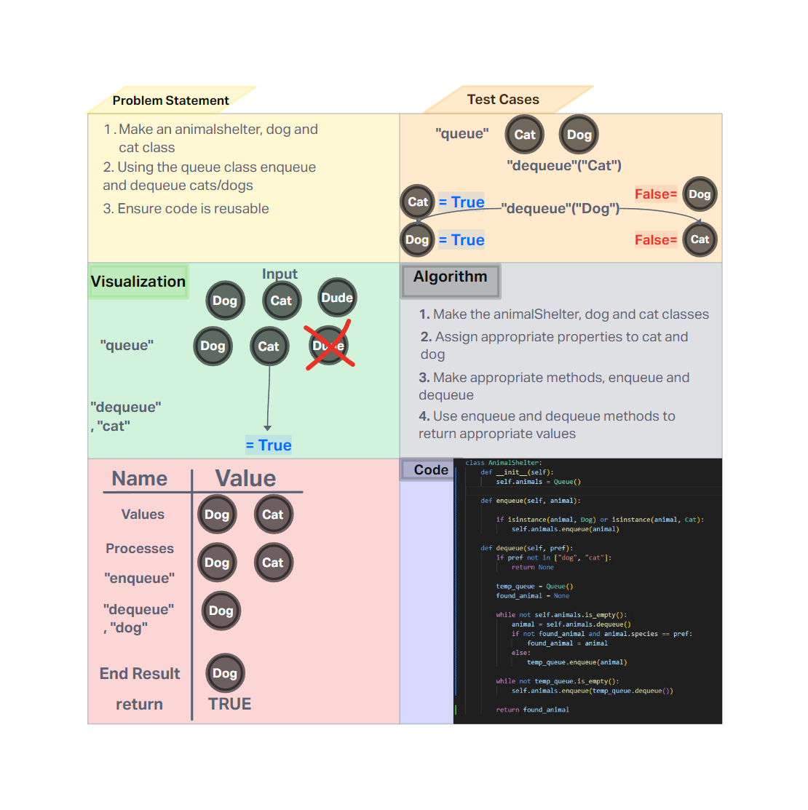

# Challenge Title
Stack queue animal shelter

## Whiteboard Process



## Approach & Efficiency
Creation of Queue and Stack, this is implemented using a linked list.

- Time Complexity

    - **dequeue: O(n)** - Worst case it could potentially go through the whole queue
    - **enqueue: O(1)** - insertion/remove will always be a constant time per operation


- Space Complexity

    - **O(n)** - The space required grows linearly as more animals gets added

## Solution

- Happy Case: It just works

```
def test_enqueue_dequeue_happy_case():
    # Happy case: Enqueue and dequeue work as expected
    shelter = AnimalShelter()
    cat = Cat("Whiskers")
    dog = Dog("Fido")
    shelter.enqueue(cat)
    shelter.enqueue(dog)
    dequeued_cat = shelter.dequeue("cat")
    dequeued_dog = shelter.dequeue("dog")
    assert dequeued_cat.name == "Whiskers"
    assert dequeued_dog.name == "Fido"
```

- Edge Case: Dequeue from an empty list returns None

```
def test_dequeue_empty_shelter_edge_case():
    # Edge case: Dequeue from an empty shelter
    shelter = AnimalShelter()
    result = shelter.dequeue("cat")
    assert result is None
```

- Expected Failure: Sending anything but a dog or cat

```
def test_dequeue_invalid_preference_expected_failure():
    # Expected failure: Dequeue with an invalid preference
    shelter = AnimalShelter()
    cat = Cat("Whiskers")
    shelter.enqueue(cat)
    result = shelter.dequeue("lizard")
    assert result is None
```