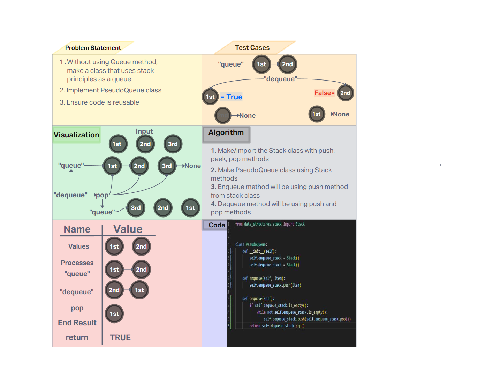

# Challenge Title
PseudoQueue implementation

## Whiteboard Process


## Approach & Efficiency
The PseudoQueue uses two stacks, enqueue_stack and dequeue_stack, to mimic the behavior of a queue.

- Time Complexity

    - **queue: O(1)** - insertion will always be a constant time per operation
    - **dequeue: O(n)** - worst case is it'll need to go through the whole list if the dequeue is empty

- Space Complexity

    - **queue: O(n)** - Space grows linearly depending on the number of items
    - **dequeue: O(n)** - Space grows linearly and it also stores both dequeue stack and enqueue stacks

## Solution

- Happy Case: 

```
def test_enqueue_and_dequeue():
    queue = PseudoQueue()
    queue.enqueue("apple")
    queue.enqueue("banana")
    queue.enqueue("cucumber")

    assert queue.dequeue() == "apple"
    assert queue.dequeue() == "banana"
    assert queue.dequeue() == "cucumber"
```

- Edge Case: Checks to the dequeue is an empty list

```
def test_dequeue_empty_queue():
    queue = PseudoQueue()
    assert queue.dequeue() is None
```

- Expected Failure: None is considered an invalid input

```
def test_invalid_input():
    queue = PseudoQueue()
    try:
        queue.enqueue(None)  # Assuming None is invalid
        assert False, "Enqueue should fail with invalid input"
    except ValueError:
        assert True
```