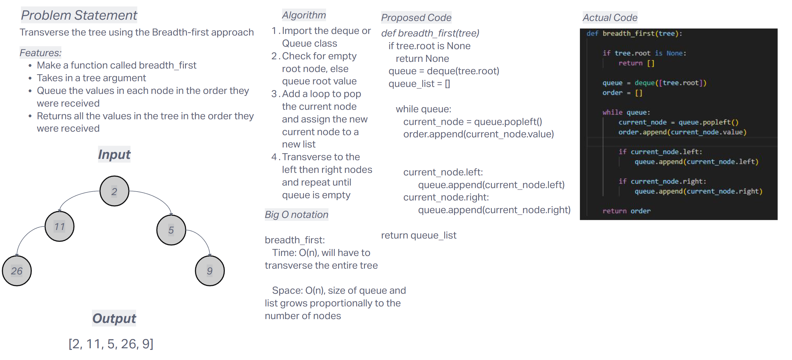

# Challenge Title
Breadth_first

## Whiteboard Process


## Approach & Efficiency
the breadth_first function, the approach is to traverse the binary tree in a level-order manner

- Time Complexity

    - **breadth_first: O(n)** - Will always have to transverse the whole tree

- Space Complexity

    - **breadth_first: O(n)** - Size of the queue increases proportionally with inputs

## Solution

- Happy Case:  

```
def test_breadth_first_happy_case():
    tree = BinaryTree()
    tree.root = TreeNode('A')
    tree.root.left = TreeNode('B')
    tree.root.right = TreeNode('C')
    tree.root.left.left = TreeNode('D')
    tree.root.left.right = TreeNode('E')
    tree.root.right.left = TreeNode('F')

    expected = ['A', 'B', 'C', 'D', 'E', 'F']
    actual = breadth_first(tree)
    assert actual == expected, f"Expected {expected}, but got {actual}"
```

- Edge Case: test to see if it'll return an empty list

```
def test_breadth_first_empty_tree():
    tree = BinaryTree()
    expected = []
    actual = breadth_first(tree)
    assert actual == expected, f"Expected {expected} for an empty tree, but got {actual}"
```

- Expected Failure: Pass non standard data types, dictionary

```
def test_breadth_first_unexpected_data():
    tree = BinaryTree()
    tree.root = TreeNode(None)
    tree.root.left = TreeNode({"key": "value"})
    tree.root.right = TreeNode(123)

    expected = [None, {"key": "value"}, 123]
    actual = breadth_first(tree)
    assert actual == expected, f"Expected {expected}, but got {actual}"

```