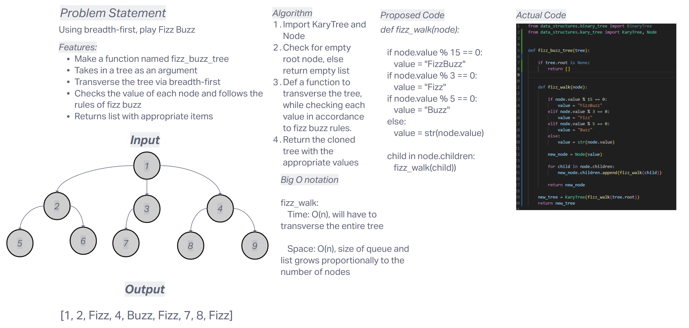

# Challenge Title
Implemented fizz_buzz_tree

## Whiteboard Process


## Approach & Efficiency
The approach is to transverse a tree using breadth-first while following the rules of fizz buzz

- Time Complexity

    - **fizz_buzz_tree: O(n)** - worst case, will have to transverse the whole tree, O(1) if recieves an empty list

- Space Complexity

    - **fizz_buzz_tree: O(n)** - worst case, cloning the existing list and the size grows proportionally with inputs.

## Solution


### Happy Case
```
def test_fizz_buzz_tree_happy_case():
    tree = KaryTree(Node(15))
    tree.root.children = [Node(3), Node(5), Node(4)]

    # Applying FizzBuzz transformation
    result_tree = fizz_buzz_tree(tree)

    assert result_tree.root.value == "FizzBuzz"
    assert result_tree.root.children[0].value == "Fizz"
    assert result_tree.root.children[1].value == "Buzz"
    assert result_tree.root.children[2].value == "4"
```
### Edge Case Test - Passing in an empty tree
```
def test_fizz_buzz_tree_empty():
    tree = KaryTree(None)

    # Applying FizzBuzz transformation
    result_tree = fizz_buzz_tree(tree)

    assert result_tree.root is None
```
### Expected Failure - Passing an invalid input
```
def test_fizz_buzz_tree_invalid_input():
    tree = KaryTree(Node("invalid"))
    tree.root.children = [Node("data"), Node(5)]

    with pytest.raises(TypeError):
        fizz_buzz_tree(tree)
```