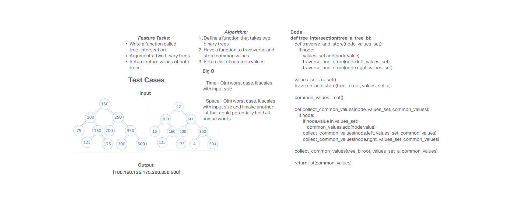

# Challenge Title
In two given trees, return common values

## Whiteboard Process


## Approach & Efficiency
Transverse the trees respectively, store each nodes value and check the values and return the common values

- Time Complexity

    - **O(n)** - Will always visit each node atleast once

- Space Complexity

    - **O(n)** - worst case, need 2 more additional lists, one to store all values, another to store common values

## Solution

- Happy Case: 

```
def test_happy_case_common_elements():
    tree_a = BinaryTree()
    add_values_to_empty_tree(tree_a, [1, 2, 3, 4])
    
    tree_b = BinaryTree()
    add_values_to_empty_tree(tree_b, [3, 4, 5, 6])
    
    actual = tree_intersection(tree_a, tree_b)
    expected = [3, 4]
    assert sorted(actual) == sorted(expected), f"Expected {expected}, but got {actual}"
```

- Edge Case: Checks to the head of the empty list, points to newly inserted node

```
def test_edge_case_large_tree_and_empty_tree():
    # Large tree
    tree_a = BinaryTree()
    large_values = list(range(1000))  # Tree A with 1000 nodes
    add_values_to_empty_tree(tree_a, large_values)
    
    # Empty tree
    tree_b = BinaryTree()  # Tree B is empty
    
    actual = tree_intersection(tree_a, tree_b)
    expected = []  # No common elements since tree_b is empty
    assert actual == expected, f"Expected {expected}, but got {actual}"

```

- Expected Failure:

```
def test_expected_failure_null_trees():
    # Assuming tree_intersection is not designed to handle None inputs
    tree_a = None
    tree_b = None
    
    with pytest.raises(TypeError):
        tree_intersection(tree_a, tree_b)

```