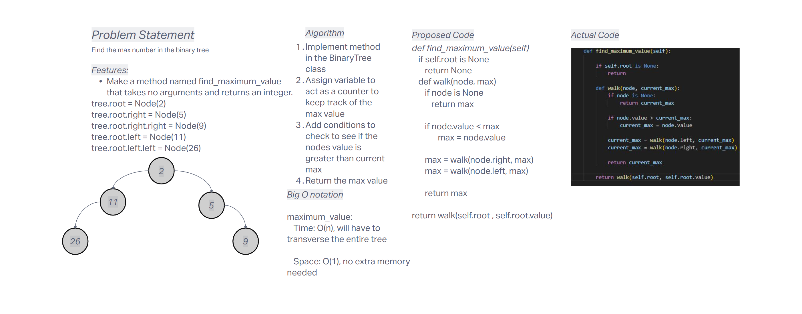

# Challenge Title
Implement find maximum value method

## Whiteboard Process


## Approach & Efficiency
Create a new method in the Binary Tree class to find the maximum value in a binary tree.

- Time Complexity

    - **find_maximum_value: O(n)** - will always need to tranverse the whole tree

- Space Complexity

    - **find_maximum_value: O(n)** - recursive calls take up space and worst case if it is unbalanced(all on one side) it'll use more space as a balanced tree would be considered O(log n).

## Solution

- Happy Case: 

```
def test_return_all_values():
    linked_list = LinkedList()
    linked_list.insert(1)
    linked_list.insert(2)
    assert linked_list.to_string() == "{ 2 } -> { 1 } -> NULL"
```

- Edge Case: Checks to the head of the empty list, points to newly inserted node

```
def test_edge_case_insert_into_empty_list():
    linked_list = LinkedList()
    linked_list.insert(1)
    assert linked_list.head is not None
    assert linked_list.head.value == 1
```

- Expected Failure: Calls an empty list but returns False

```
def test_expected_failure_search_in_empty_list():
    linked_list = LinkedList()
    assert not linked_list.includes(1)
```