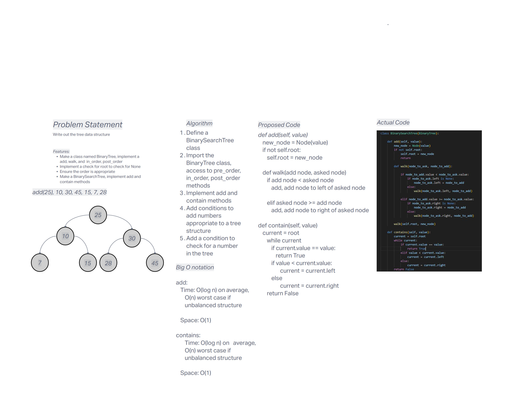

# Challenge Title
Implemented BinarySearchTree

## Whiteboard Process


## Approach & Efficiency
Creation of a node class that represents the node in a linked list.

- Time Complexity

    - **add and contain: O(log n)** - on average, worst case **O(n)**, might tranverse the whole list if unbalanced

- Space Complexity

    - **add and contain: O(1)** - No additional space needed that scales with size

## Solution


### Happy Case - Add and Check values
```
def test_add_and_check_value():
    tree = BinarySearchTree()
    tree.add(10)
    tree.add(5)
    tree.add(15)
    assert tree.contains(10) == True
    assert tree.contains(5) == True
    assert tree.contains(15) == True
```
### Edge Case Test - Adding Duplicate Values
```
def test_adding_duplicate_value():
    tree = BinarySearchTree()
    tree.add(10)
    tree.add(10)  # Adding a duplicate
    # Assuming the tree allows duplicates, the second 10 would go to the right of the first one
    assert tree.root.right.value == 10
```
### Expected Failure - Non-Existent Value
```
def test_check_non_existent_value():
    tree = BinarySearchTree()
    tree.add(10)
    tree.add(5)
    tree.add(15)
    assert tree.contains(20) == False
```